# ISA


## Документация

Вам понадобится описание Instruction Set Architecture (ISA) вашего CPU.

### arm64

Документацию можно скачать [с официального сайта](https://developer.arm.com/documentation/ddi0487/mb/?lang=en)

> Machine-Readable Descriptions for Features, Registers, and Instructions. Instructions (A64)

Для удобства документация уже сохранена локально в [ISA_A64_xml_A_profile_2026-03_96-2026-03_rel.pdf](./resources/ISA_A64_xml_A_profile_2026-03_96-2026-03_rel.pdf)

### amd64

Рекомендуется использовать зеркало [x86 and amd64 instruction reference](https://www.felixcloutier.com/x86/) и 
[Intel® 64 and IA-32 Architectures Software Developer’s Manual](https://cdrdv2-public.intel.com/774492/325383-sdm-vol-2abcd.pdf)

Для удобства документация уже сохранена локально в [Intel_64_and_IA-32_Architectures_Software_Developers_Manual.pdf](./resources/Intel_64_and_IA-32_Architectures_Software_Developers_Manual.pdf)

## Примеры

### arm64

Давайте попробуем найти какую-нибудь инструкцию и применить её на практике. Начнём
с операции сложения:

```go
// Add returns a + b.
func Add(a, b int64) int64
```

```
#include "textflag.h"

// func Add(a, b int64) int64
TEXT ·Add(SB), NOSPLIT, $0
    // Кладём первый аргумент функции в регистр R0
    MOVD first+0(FP), R0

    // Кладём второй аргумент функции в регистр R1
    MOVD second+8(FP), R1
    
    WORD 0x... // <- TODO: хотим применить инструкцию сложения R1 = R1 + R0  

    // Кладём результат с R1 на стек фрейм функции для возврата значения
    MOVD R1, ret+16(FP)
    
    // Инструкция для return
    RET
```

Заходим в документацию на страницу 2

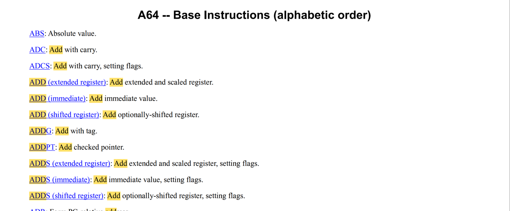

Нам здесь подходит `ADD (shifted register): Add optionally-shifted register`, поскольку мы берём значение
не из константы (immediate), а из регистра.

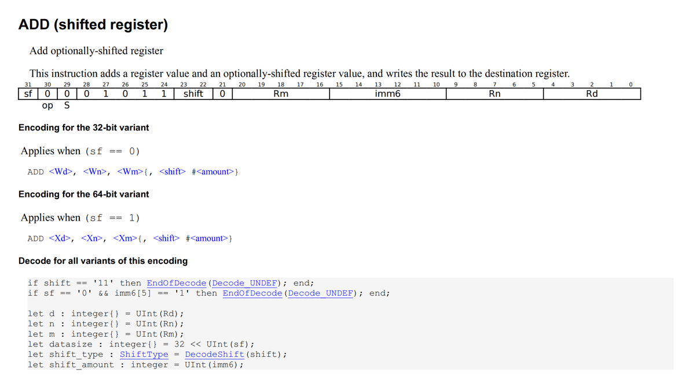

`arm64` имеет фиксированный размер инструкции (4 байта / 32 бита). Осталось только понять, как правильно их заполнить

- `sf     = 1`       Используем 64-bitный вариант инструкции
- `op     = 0`       Бит операции
- `S      = 0`       После этой инструкции мы не хотим менять регистр флагов
- `shift  = 00`      Инструкция умеет дополнительно работать со сдвигами, нам они не нужны
- `Rm     = 00000`   Указываем первый операнд, который лежит в регистре R0 (X0)
- `imm6   = 000000`  Не используем сдвиг, поэтому он 0
- `Rn     = 00001`   Указываем второй операнд, который лежит в регистре R1 (X1)
- `Rd     = 00001`   Указываем, что хотим положить результат в регистр R1 (X1)

Итого получается `1 0 0 01011 00 00000 000000 00001 00001`, в шестнадцатеричной системе счисления
`10001011000000000000000000100001` [это](https://www.rapidtables.com/convert/number/binary-to-hex.html?x=10001011000000000000000000100001) `0x8b000021`.

Нам осталось [применить](./internal/example/add/add_arm64.s) эту инструкцию:

```go
// func Add(a, b int64) int64
TEXT ·Add(SB), NOSPLIT, $0
    // Кладём первый аргумент функции в регистр R0
    MOVD first+0(FP), R0

    // Кладём второй аргумент функции в регистр R1
    MOVD second+8(FP), R1

    WORD $0x8b000021 // 10001011000000000000000000100001

    // Кладём результат с R1 на стек фрейм функции для возврата значения
    MOVD R1, ret+16(FP)

    // Инструкция для return
    RET
```

Запустим тесты в [internal/example/add](./internal/example/add):

> go test -tags=model_test -v -count=1 ./...

```
=== RUN   TestAdd
=== PAUSE TestAdd
...
...
...
--- PASS: TestAdd (0.00s)
    --- PASS: TestAdd/small_positive (0.00s)
    --- PASS: TestAdd/mixed_negative (0.00s)
    --- PASS: TestAdd/small_negative (0.00s)
    --- PASS: TestAdd/big_positive (0.00s)
    --- PASS: TestAdd/check_threshold (0.00s)
    --- PASS: TestAdd/big_negative (0.00s)
PASS
ok      github.com/igoroutine-courses/gonature.isa/internal/example/add 0.312s
```


При желании всю функцию можно было бы переписать через директиву `WORD`

```go
// func Add(a, b int64) int64
TEXT ·Add(SB), NOSPLIT, $0
    WORD $0xf94007e0 // MOVD 8(RSP), R0
    WORD $0xf9400be1 // MOVD 16(RSP), R1
    WORD $0x8b000021 // R1 = R1 + R0
    WORD $0xf9000fe1 // MOVD R1, 24(RSP)
    WORD $0xd65f03c0 // RET
```


Теперь попробуем сделать что-нибудь посложнее, например, применить SIMD-инструкции
для ускорения функции минимума двух векторов `[4]int32`:

```go
func main() {
	first := [4]int32{1, 3, 5, 7}
	second := [4]int32{2, 4, 6, 8}
	dst := [4]int32{}

	Min4(&first, &second, &dst)
	fmt.Println(dst) // [1 3 5 7]
}

// Min4 computes the element-wise signed minimum of two vectors of four int32 values
// and stores the result in dst.
func Min4(first, second, dst *[4]int32)
```

В данном случае нам нужно найти SIMD-инструкцию для минимума:

```go
// func Min4(first, second, dst *[4]int32)
TEXT ·Min4(SB), NOSPLIT, $0
    // Кладём указатель на память first в регистр R0
    MOVD first+0(FP), R0

    // Кладём указатель на память second в регистр R1
    MOVD second+8(FP), R1

    // Кладём указатель на память dst в регистр R2
    MOVD dst+16(FP), R2

    // Загружаем 128-бит в векторный регистр V1 (S - single precision, 4 элемента)
    VLD1 (R0), [V1.S4]

    // Загружаем 128-бит в векторный регистр V2 (S - single precision, 4 элемента)
    VLD1 (R1), [V2.S4]

    // <- TODO: хотим применить SIMD-инструкцию V3[i] = min(V1[i], V2[i])

    // Записываем результат в память по указателю из регистра R2
    VST1 [V3.S4], (R2)

    // Инструкция для return
    RET
```

Если в предыдущем примере `ADD` был поддержан как мнемоника на уровне ассемблера Go и мы выводили его сами через документацию ради тренировки,
то в этом случае нужной нам инструкции на уровне ассемблера Go попросту нет.

Открываем страницу 895 `A64 -- SIMD and Floating-point Instructions (alphabetic order)` 

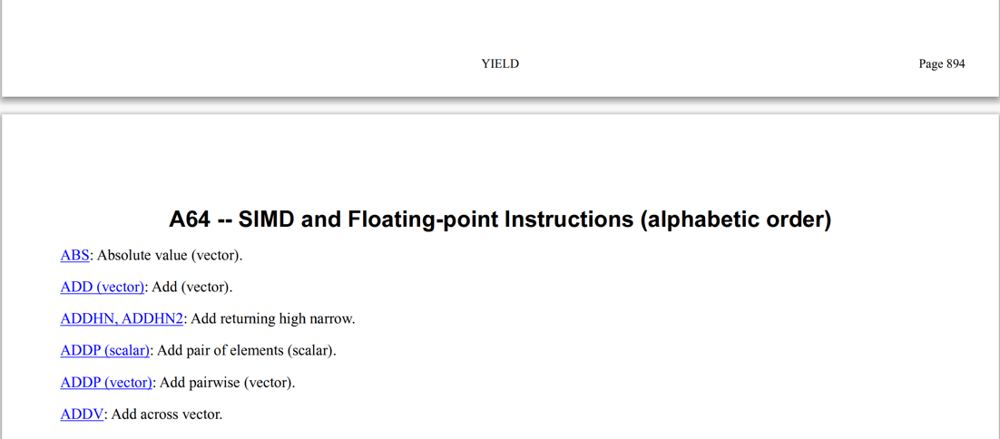

Находим нужную нам инструкцию на странице 1464:

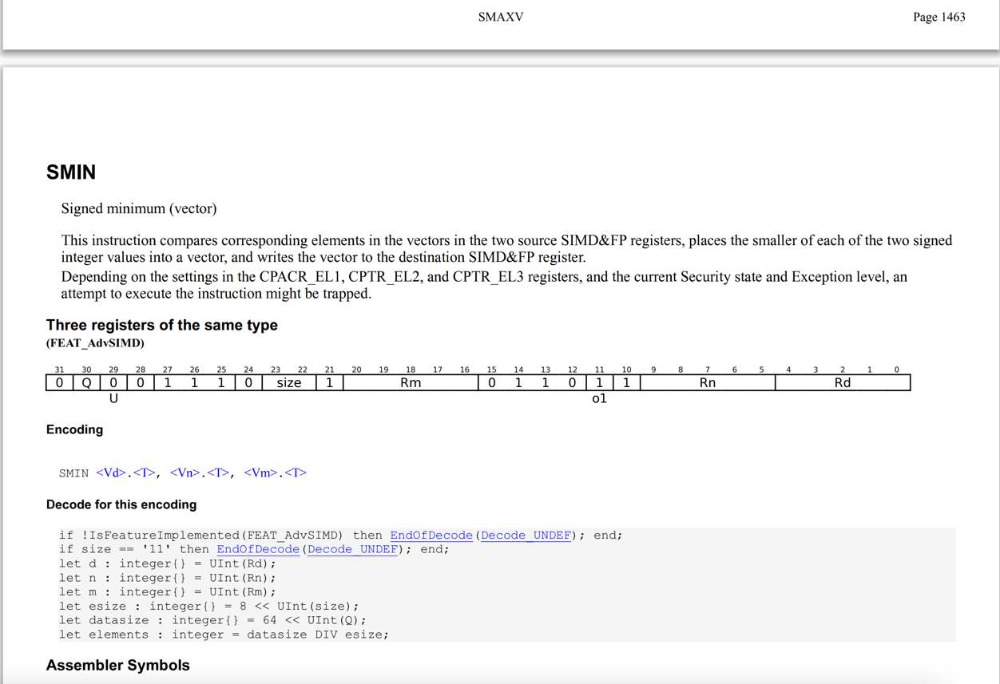

arm64 имеет фиксированный размер инструкции (4 байта/32 бита). Нам осталось понять, как правильно их заполнить

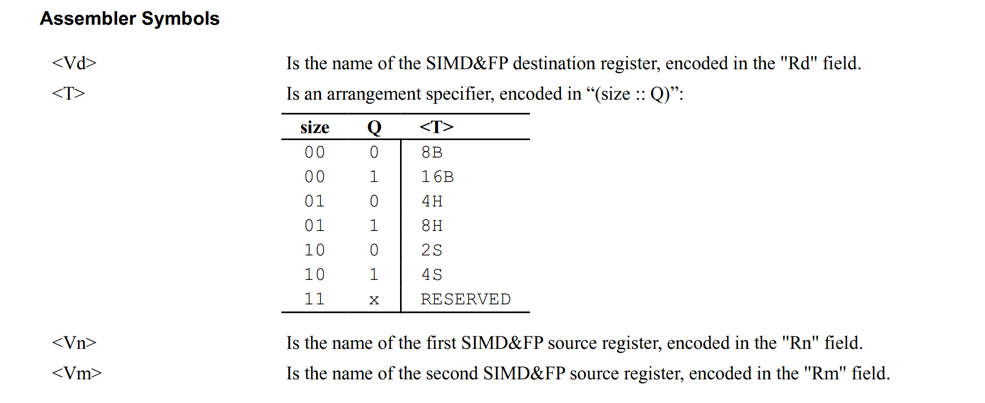

По таблице смотрим, что `size` у нас будет `10`, `Q` (векторный режим) будет `1`.

> Исторически буква S пришла из single-precision формата IEEE-754. В терминологии стандарта это 32-битные значения, то есть int32 в 
> нашем случае

- `Q     = 1`        Размер SIMD регистра, который участвует в операции (64 или 128)
- `U     = 0`        Signed сравнение (U = 0 - signed, U = 1 - unsigned)
- `size  = 10`       По описанию выше
- `Rm    = 00010`    Регистр V2
- `Rn    = 00001`    Регистр V1
- `Rd    = 00011`    Регистр V3 для результата

Итого получается `0 1 001110 10 1 00010 011011 00001 00011`, в шестнадцатеричной системе счисления
`01001110101000100110110000100011` [это](https://www.rapidtables.com/convert/number/binary-to-hex.html?x=01001110101000100110110000100011) `0x4ea26c23`

Нам осталось [применить](./internal/example/min4/min4_arm64.s) эту инструкцию:

```go
#include "textflag.h"

// func Min4(first, second, dst *[4]int32)
TEXT ·Min4(SB), NOSPLIT, $0
    // Кладём указатель на память first в регистр R0
    MOVD first+0(FP), R0

    // Кладём указатель на память second в регистр R1
    MOVD second+8(FP), R1

    // Кладём указатель на память dst в регистр R2
    MOVD dst+16(FP), R2

    // Загружаем 128-бит в векторный регистр V1 (S - single precision, 4 элемента)
    VLD1 (R0), [V1.S4]

    // Загружаем 128-бит в векторный регистр V2 (S - single precision, 4 элемента)
    VLD1 (R1), [V2.S4]

    WORD $0x4ea26c23 // 01001110101000100110110000100011

    // Записываем результат в память по указателю из регистра R2
    VST1 [V3.S4], (R2)

    // Инструкция для return
    RET
```

Запустим тесты в [internal/example/add](./internal/example/min4):

> go test -tags=model_test -v -count=1 ./...

```
=== RUN   TestMin4
=== RUN   TestMin4/first_all_smaller
=== PAUSE TestMin4/first_all_smaller
=== RUN   TestMin4/second_all_smaller
=== PAUSE TestMin4/second_all_smaller

...
...
...
    --- PASS: TestMin4AgainstReferenceImplementation/#24 (0.00s)
=== CONT  TestMin4DoesNotModifyInputs
--- PASS: TestMin4DoesNotModifyInputs (0.00s)
=== CONT  TestMin4OverwritesDst
--- PASS: TestMin4OverwritesDst (0.00s)
PASS
ok      github.com/igoroutine-courses/gonature.isa/internal/example/min4        0.405s
```

Более того, запустим performance тесты и посмотрим, насколько получилось ускорить один из бенчмарков:

> go test -tags=performance_test -gcflags='-N -l' -count=1 -v ./...

```
=== RUN   TestMin4SIMDPerformance
    performance_test.go:53: simd:      109452795
    performance_test.go:54: reference: 270578802
    performance_test.go:55: ratio simd/reference: 0.405
    performance_test.go:56: speedup: 2.47x
--- PASS: TestMin4SIMDPerformance (4.31s)
PASS
ok      github.com/igoroutine-courses/gonature.isa/internal/example/min4        4.801s
```

Без оптимизаций компилятора получилось ускорить **более чем в 2 раза**


> ⚠️ **Помните:** любой бенчмарк всегда зависит от нагрузки и данных.


### amd64

Давайте попробуем найти какую-нибудь инструкцию в документации и применить её на практике. Начнём
с операции сложения:

```go
// Add returns a + b.
func Add(a, b int64) int64
```

```go
// func Add(a, b int64) int64
TEXT ·Add(SB), NOSPLIT, $0
    // Кладём первый аргумент функции в регистр AX
    MOVQ first+0(FP), AX

    // Кладём второй аргумент функции в регистр CX
    MOVQ second+8(FP), CX

    // TODO: WORD, BYTE, хотим применить инструкцию сложения AX = AX + CX

    // Кладём результат с AX на стек фрейм функции для возврата значения
    MOVQ AX, ret+16(FP)

    // Инструкция для return
    RET
```

В отличие от удобной документации `arm64`, с `amd64` все немного сложнее, здесь используется
variable-length encoding.

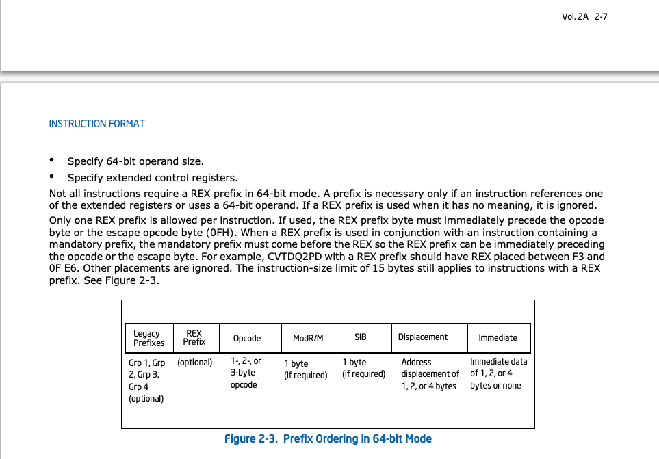

Инструкция может занимать от 1 до 15 байт и обычно состоит из:

```text
[prefixes] [opcode] [ModRM] [SIB?] [disp?] [imm?]
```

Нас интересует формат инструкций с `REX Prefixes` (Register Extension Prefixes - однобайтовые префиксы в архитектуре x86-64, используемые для реализации 64-битных операций).

REX prefix появился в x86-64 по двум причинам:

1) нужно было добавить поддержку 64-битных операций и регистров
2) нужно было добавить новые регистры R8-R15

Исторически x86 начинался как 16-битная архитектура с регистрами по 16 бит (`AX, BX, CX, DX`). 
Позже регистры расширили до 32 бит (`EAX, ECX, EDX, EBX, ESP, EBP, ESI, EDI`). 
В x86-64 они были расширены до 64 бит (`RAX, RCX, RDX, RBX, RSP, RBP, RSI, RDI`).

То есть:

- `RAX` = 64-битное расширение EAX
- `AX`  = младшие 16 бит
- `AL`  = младшие 8 бит

Но одной только поддержки 64-битных операций оказалось мало. Архитектуре также понадобились новые регистры:

R8 R9 R10 R11 R12 R13 R14 R15

Проблема в том, что старый x86 encoding умел кодировать только 8 регистров (использовалось всего 3 бита).
Этого хватает только на 8 значений. Поэтому в x86-64 добавили специальный префикс `REX`.

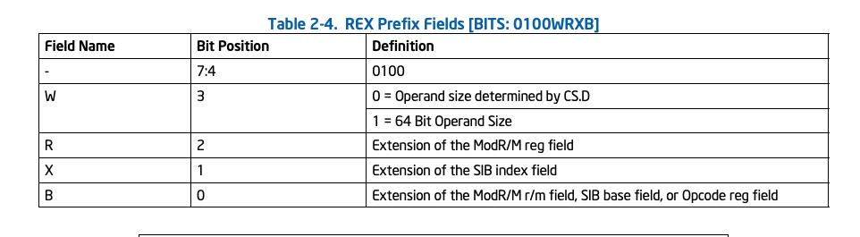

REX prefix имеет формат:

`0100WRXB`

Для нашей инструкции нужен:

- `W = 1` включает 64-bit operand size
- `R = 0` не используем новые R8-R15 (у нас только RAX, RCX, нет R8-R15)
- `X = 0` не используем SIB index (используется для сложной адресации в памяти, [RAX + RCX*4], у нас такого нет)
- `B = 0` не используем новые R8-R15 (у нас только RAX, RCX, нет R8-R15)

Грубо говоря, R и B нужны, чтобы добавить новые регистры R8-R15

Итого, первая часть нашей инструкции это `01001000`, [то есть](https://www.rapidtables.com/convert/number/binary-to-hex.html?x=01001000) `0x48`.

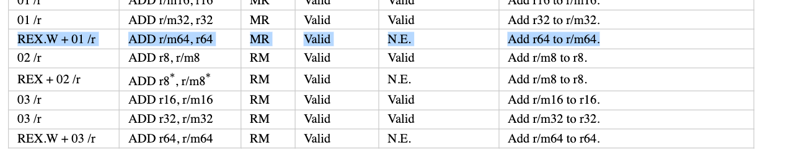

Следующий байт кодирует код операции, [в нашем случае это](https://www.felixcloutier.com/x86/add) `01` (ADD).

Финальный байт кодирует параметры (аргументы) инструкции:
1) `mod` режим адресации
2) `reg` source (`register operand`)
3) `r/m` dst (`register-or-memory operand`)

> `R` и `B` из `REX prefix` как раз добавляют четвёртый бит к полю `reg` и `r/m` для регистров R8-R15.


Напомню, что мы хотим сделать операцию `RAX = RAX + RCX`
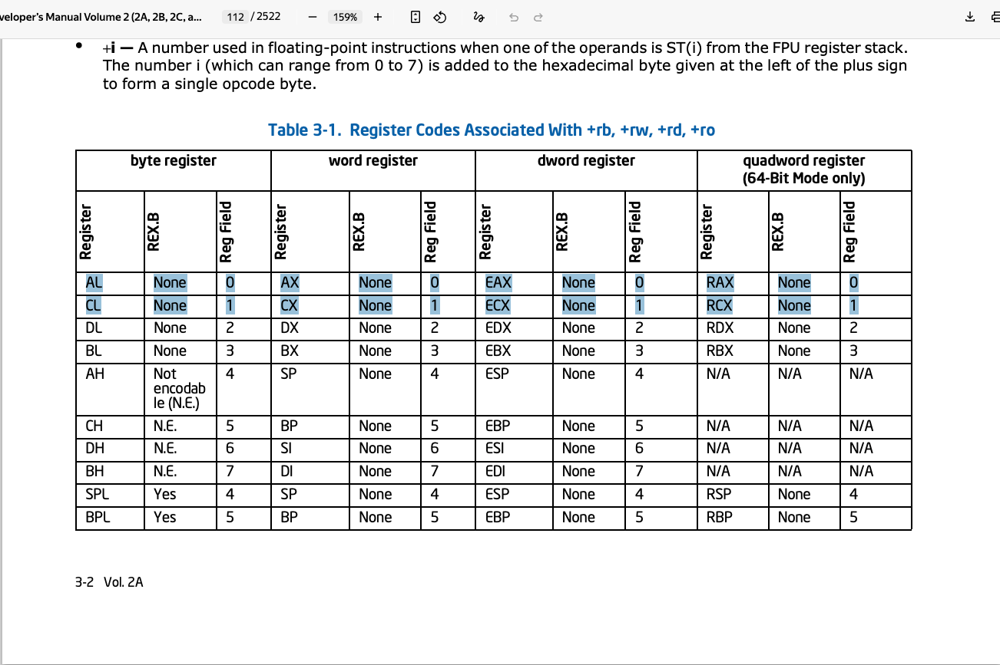 

Получаем
```
RCX = 001
RAX = 000
```

Нам нужен MOD 11 (register-register форма, то есть инструкция работает с двумя регистрами, operand r/m интерпретируется как регистр, а не память)

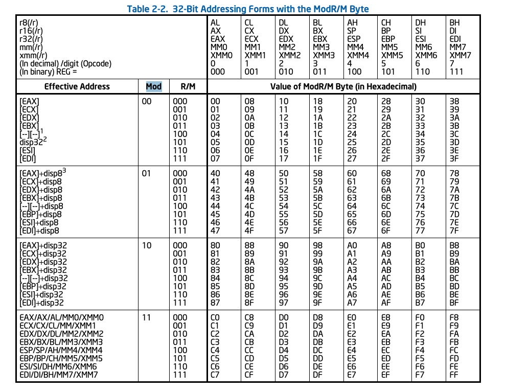

Поэтому ModRM получается:

```
mod reg r/m
11  001 000
```

Итого третий байт выглядит как `11001000`, [то есть](https://www.rapidtables.com/convert/number/binary-to-hex.html?x=11001000) `0xc8`.

Осталось записать наши байты в код на ассемблере Go:

```go
// func Add(a, b int64) int64
TEXT ·Add(SB), NOSPLIT, $0
    // Кладём первый аргумент функции в регистр AX
    MOVQ first+0(FP), AX

    // Кладём второй аргумент функции в регистр CX
    MOVQ second+8(FP), CX

    BYTE $0x48 // 01001000
    BYTE $0x01 // 00000001
    BYTE $0xc8 // 11001000

    // Кладём результат с AX на стек фрейм функции для возврата значения
    MOVQ AX, ret+16(FP)

    // Инструкция для return
    RET
```

Запустим тесты в [internal/example/add](./internal/example/add):

> go test -tags=model_test -v -count=1 ./...

```
=== RUN   TestAdd
=== PAUSE TestAdd
=== CONT  TestAdd
=== RUN   TestAdd/small_positive
=== PAUSE TestAdd/small_positive
=== RUN   TestAdd/small_negative
=== PAUSE TestAdd/small_negative
=== RUN   TestAdd/mixed_negative
=== PAUSE TestAdd/mixed_negative
=== RUN   TestAdd/big_positive
=== PAUSE TestAdd/big_positive
=== RUN   TestAdd/big_negative
=== PAUSE TestAdd/big_negative
=== RUN   TestAdd/check_threshold
=== PAUSE TestAdd/check_threshold
=== CONT  TestAdd/small_positive
=== CONT  TestAdd/mixed_negative
=== CONT  TestAdd/big_positive
=== CONT  TestAdd/small_negative
=== CONT  TestAdd/check_threshold
=== CONT  TestAdd/big_negative
--- PASS: TestAdd (0.00s)
    --- PASS: TestAdd/small_positive (0.00s)
    --- PASS: TestAdd/mixed_negative (0.00s)
    --- PASS: TestAdd/small_negative (0.00s)
    --- PASS: TestAdd/big_positive (0.00s)
    --- PASS: TestAdd/check_threshold (0.00s)
    --- PASS: TestAdd/big_negative (0.00s)
PASS
ok      github.com/igoroutine-courses/gonature.isa/internal/example/add 0.312s
```


При желании абсолютно всю функцию можно было бы переписать через директиву `BYTE`

```go
// func Add(a, b int64) int64
TEXT ·Add(SB), NOSPLIT, $0
    BYTE $0x48
    BYTE $0x8b
    BYTE $0x44
    BYTE $0x24
    BYTE $0x08
    BYTE $0x48
    BYTE $0x8b
    BYTE $0x4c
    BYTE $0x24
    BYTE $0x10
    BYTE $0x48
    BYTE $0x01
    BYTE $0xc8
    BYTE $0x48
    BYTE $0x89
    BYTE $0x44
    BYTE $0x24
    BYTE $0x18
    BYTE $0xc3
```

Теперь давайте попробуем сделать что-нибудь посложнее, например, применить SIMD-инструкции
для ускорения функции минимума двух векторов `[4]int32`:

```go
func main() {
	first := [4]int32{1, 3, 5, 7}
	second := [4]int32{2, 4, 6, 8}
	dst := [4]int32{}

	Min4(&first, &second, &dst)
	fmt.Println(dst) // [1 3 5 7]
}

// Min4 computes the element-wise signed minimum of two vectors of four int32 values
// and stores the result in dst.
func Min4(first, second, dst *[4]int32)
```

В данном случае нам нужно найти SIMD-инструкцию для минимума:

```
#include "textflag.h"

// func Min4(first, second, dst *[4]int32)
TEXT ·Min4(SB), NOSPLIT, $0
    // Кладём указатель на память first в регистр AX
    MOVQ first+0(FP), AX
    
    // Кладём указатель на память second в регистр CX
    MOVQ second+8(FP), CX
    
    // Кладём указатель на память dst в регистр DX
    MOVQ dst+16(FP), DX

    WORD 0x... // <- TODO: хотим применить SIMD-инструкцию V3[i] = min(V1[i], V2[i])

    // Записываем результат в память по указателю из регистра DX
    VMOVDQU X3, (DX)
    
    // Инструкция для return
    RET
```

Если в предыдущем примере `ADD` был поддержан как мнемоника на уровне ассемблера Go и мы выводили его сами через документацию ради тренировки,
то в этом случае нужной нам инструкции на уровне ассемблера Go попросту нет.

Для SIMD-инструкций в `amd64` используется уже не `REX`, а более современный формат кодирования
`VEX prefix`.


VEX prefix появился вместе с AVX-инструкциями и решает сразу несколько проблем старого x86 encoding:

- добавляет новые SIMD-инструкции
- расширяет количество SIMD-регистров
- уменьшает размер некоторых SIMD-инструкций

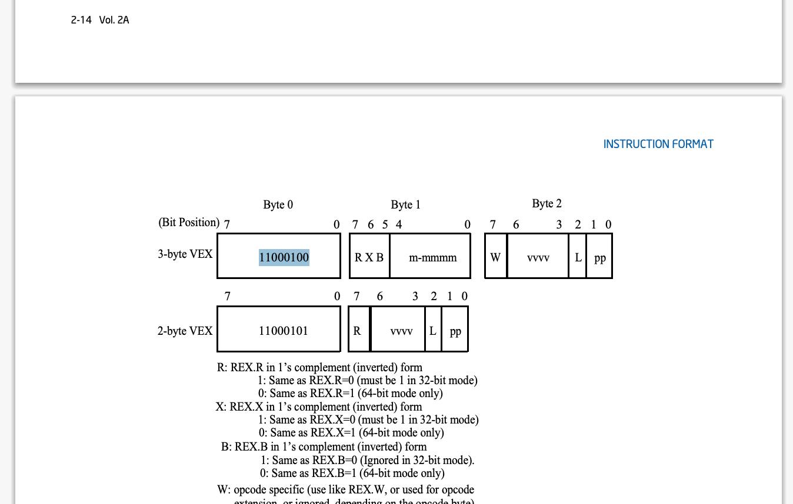

Для того, чтобы вывести первый байт инструкции, нужно понять, какой формат VEX будет использован (`2-byte VEX` или `3-byte VEX`).

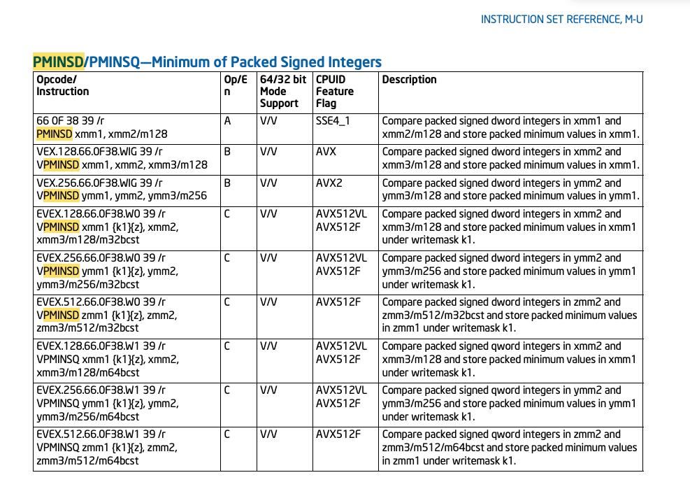

Нас интересует инструкция `PMINSD` (на `amd64` D - double word, то есть 32 бита, Q - quadword, то есть 64 бита).

```
VEX.128.66.0F38.WIG 39 /r
VPMINSD xmm1, xmm2, xmm3/m128
```

- `VEX`	 используем VEX encoding
- `128`	 128-bit SIMD
- `0F 38` opcode map (отсюда процессор понимает, что инструкцию надо искать в таблице `0F 38`, при этом `0F`, `0F 38` и `0F 3A` это разные opcode maps)
- `39` конкретная операция в таблице `0F38` 

Видим, что у этой инструкции opcode map `0F38`, в документации находим фразу:

> The presence of 0F3A and 0F38 in the opcode column implies that opcode can only be encoded by the three-byte form of VEX

Значит, мы будем использовать `3-byte VEX`, поэтому первый байт будет `11000100`, [то есть](https://www.rapidtables.com/convert/number/binary-to-hex.html?x=11000100) `0xc4`

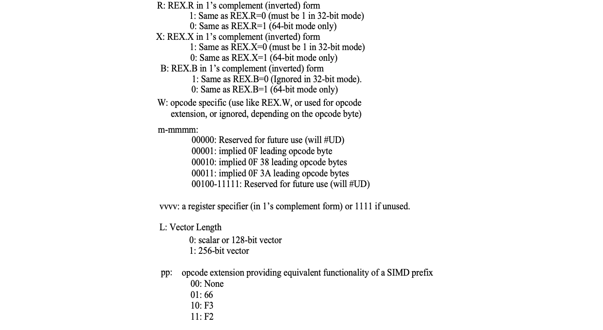

Второй байт выглядит как `RXBm-mmmm`. `m-mmmm` мы можем получить по таблице на картинке выше (opcode `0F 38` -> `00010`).

```
R X B m-mmmm
x x x 00010
```

Как и в REX, RXB это extension bits для регистров. Но в VEX они инвертированы.

`1 = extension bit disabled`

`0 = extension bit enabled`

У нас:

`R = 1` 

`X = 1`

`B = 1`

Итого, второй байт выглядит как `11100010`, [то есть](https://www.rapidtables.com/convert/number/binary-to-hex.html?x=11100010) `0xe2`

Для получения третьего байта детальнее посмотрим на описание инструкции:


```
VEX.128.66.0F38.WIG 39 /r
VPMINSD xmm1, xmm2, xmm3/m128
```

- `66`	 нужен implied prefix 66
- `WIG`	 W ignored

Третий байт имеет формат `W vvvv L pp`. Документация пишет про `W ignored`, поэтому имеем `0 vvvv L pp`.
`L` кодирует размер (128 или 256), у нас `L = 0`.

`pp` в свою очередь кодирует legacy SIMD prefixes внутри VEX encoding.

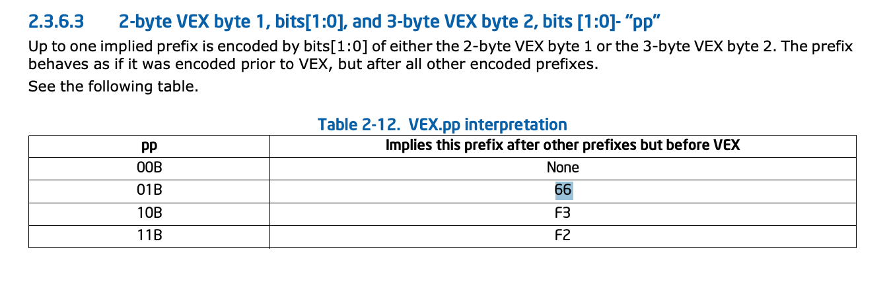

Intel в какой-то момент захотели убрать лишние префиксы и сократить размер инструкций.

> Legacy SSE instructions effectively use SIMD prefixes (66H, F2H, F3H) as an opcode extension field.

Интуитивно, по этим двум битам процессор понимает, какой на самом деле длинный префикс имели в виду. То есть, мы передаём 2 бита,
а на уровне железа (стадия декодирования инструкции) они раскрываются в длинный префикс.

В нашем случае `66 -> 01`

Итого получаем `0 vvvv 0 01`.

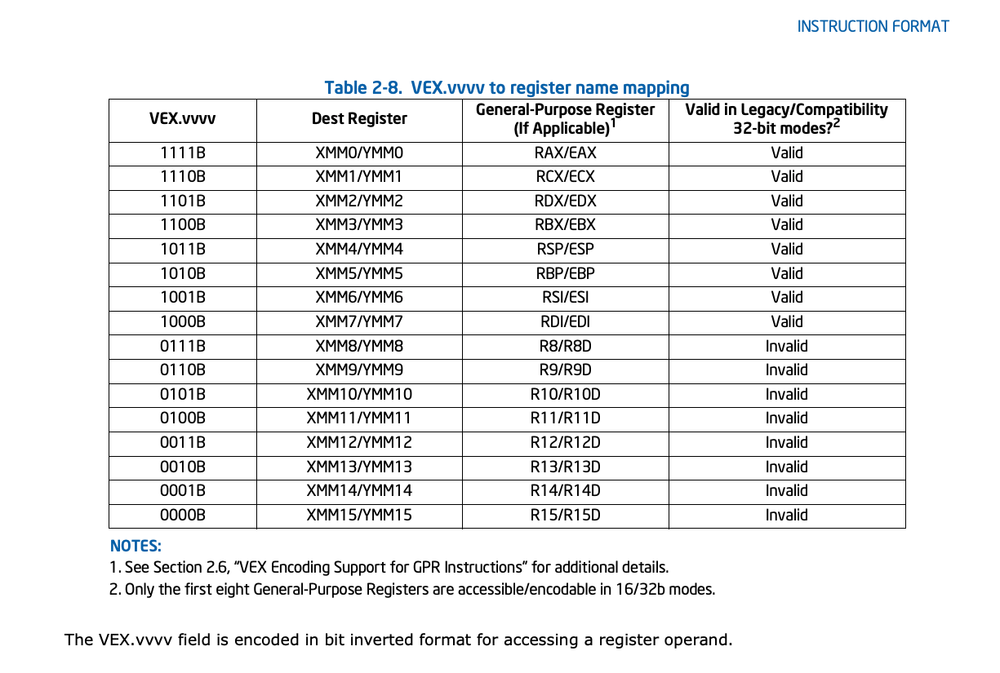

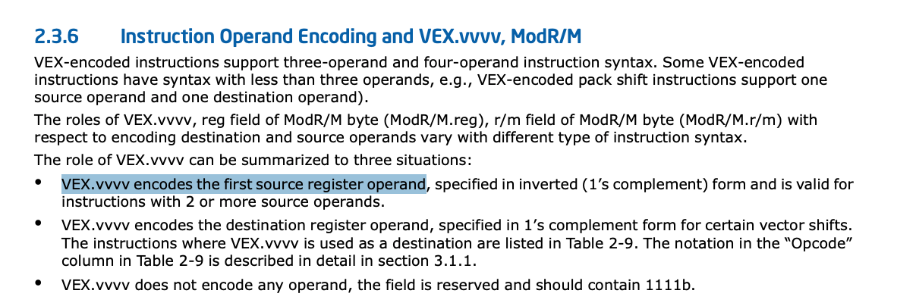

`VEX.vvvv encodes the first source register operand` (в нашем случае xmm2 из VPMINSD xmm1 (dst), xmm2 (src1), xmm3 (src2) /m128).

- dst = X3
- src1 = X1
- src2 = X2

То есть, внутри vvvv кодируется первый регистр операции,
он как раз был добавлен, чтобы поддержать 3 операнда в инструкциях (исторически x86 был 2-operand ISA, где `dst = dst op src`).

Важно, что VEX.vvvv хранится инвертированным. Это было сделано, чтобы сохранить обратную совместимость с `LES/LDS` и поддержать
новые `2-byte VEX` и `3-byte VEX`.

По таблице выше получаем, что в нашем случае для `X1` `vvvv = 1110` (X1 имеет код 0001, ~0001 = 1110)

Итого `W vvvv L pp` -> `01110001`, [то есть](https://www.rapidtables.com/convert/number/binary-to-hex.html?x=01110001) `0x71` 


Следующий байт это код инструкции

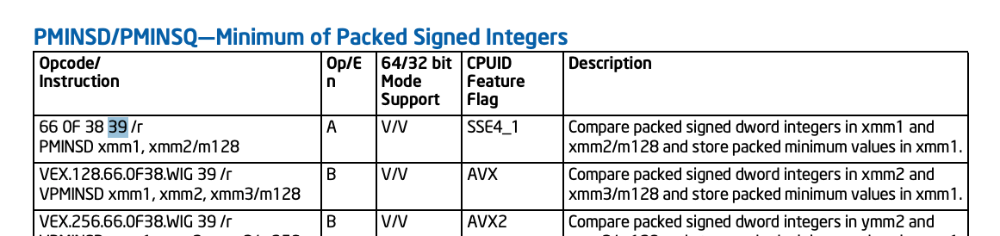


В нашем случае `0x39`, [то есть](https://www.rapidtables.com/convert/number/hex-to-binary.html?x=39) `00111001`.

Финальный пятый байт  кодирует аргументы инструкции:
1) `mod` режим адресации (как и в примере с Sub у нас тут `11`)
2) `reg` dst (в AVX/VEX тут хранится dst, куда положить результат, у нас это `X3`, то есть `011`)
3) `r/m` src (`X2`, то есть `010`)

Итого, пятый байт `11011010`, [то есть](https://www.rapidtables.com/convert/number/binary-to-hex.html?x=11011010) `0xda` 

Нам осталось [применить](./internal/example/min4/min4_amd64.s) эту инструкцию:

```go
#include "textflag.h"

// func Min4(first, second, dst *[4]int32)
TEXT ·Min4(SB), NOSPLIT, $0
    // Кладём указатель на память first в регистр AX
    MOVQ first+0(FP), AX

    // Кладём указатель на память second в регистр CX
    MOVQ second+8(FP), CX

    // Кладём указатель на память dst в регистр DX
    MOVQ dst+16(FP), DX

    // Загружаем 128-бит в векторный регистр X1 (S - single precision, 4 элемента)

    // Загружаем 128-бит в векторный регистр X2 (S - single precision, 4 элемента)
    VMOVDQU (AX), X1
    VMOVDQU (CX), X2

    BYTE $0xc4 // 11000100
    BYTE $0xe2 // 11100010
    BYTE $0x71 // 01110001
    BYTE $0x39 // 00111001
    BYTE $0xda // 11011010

    // Записываем результат в память по указателю из регистра DX
    VMOVDQU X3, (DX)

    // Инструкция для return
    RET
```

Запустим тесты в [internal/example/add](./internal/example/min4):

> go test -tags=model_test -v -count=1 ./...

```
=== RUN   TestMin4
=== RUN   TestMin4/first_all_smaller
=== PAUSE TestMin4/first_all_smaller
=== RUN   TestMin4/second_all_smaller
=== PAUSE TestMin4/second_all_smaller

...
...
...
    --- PASS: TestMin4AgainstReferenceImplementation/#24 (0.00s)
=== CONT  TestMin4DoesNotModifyInputs
--- PASS: TestMin4DoesNotModifyInputs (0.00s)
=== CONT  TestMin4OverwritesDst
--- PASS: TestMin4OverwritesDst (0.00s)
PASS
ok      github.com/igoroutine-courses/gonature.isa/internal/example/min4        0.405s
```

Более того, запустим performance тесты и посмотрим, насколько получилось ускорить один из бенчмарков:

> go test -tags=performance_test -gcflags='-N -l' -count=1 -v ./...

```
=== RUN   TestMin4SIMDPerformance
    performance_test.go:53: simd:      109452795
    performance_test.go:54: reference: 270578802
    performance_test.go:55: ratio simd/reference: 0.405
    performance_test.go:56: speedup: 2.47x
--- PASS: TestMin4SIMDPerformance (4.31s)
PASS
ok      github.com/igoroutine-courses/gonature.isa/internal/example/min4        4.801s
```

Без оптимизаций компилятора получилось ускорить **более чем в 2 раза**


> ⚠️ **Помните:** любой бенчмарк всегда зависит от нагрузки и данных.


## Задание

По аналогии с примерами, вам предлагается реализовать на одной из платформ:


Операцию [вычитания](./internal/solution/sub):

```go
// Sub returns a - b.
func Sub(a, b int64) int64

```

Векторный [максимум](./internal/solution/max4) для `[4]int32`

```go
// Max4 computes the element-wise signed maximum of two vectors of four int32 values
// and stores the result in dst.
func Max4(first, second, dst *[4]int32)
```

Стоит заметить, что новый пакет [simd/archsimd](https://pkg.go.dev/simd/archsimd) как раз абстрагирует от конечных программистов
работу с машинными инструкциями процессора. В Go 1.26 он поддерживал только `amd64`;
в Go 1.27 добавлены `arm64` Neon и WebAssembly SIMD, а также отдельный переносимый
пакет `simd`. Оба пакета пока экспериментальные (`GOEXPERIMENT=simd`).
Актуальные примеры: [archsimd для amd64/arm64](../04_archsimd/),
[переход simd → archsimd](../05_archsimd_for_another_arch/),
[переносимый поиск байта](../06_portable_simd/).

## Диагностика

- При запуске `go run main.go` может быть ошибка `missing function body`, в таком случае следует запускать  `go run .`

- Если performance тесты упали на границе требований, попробуйте перезапустить их, иногда они могут моргать

## Подсказки

<details>
<summary>Откройте, если хотите увидеть подсказку для Sub ARM64</summary>

```
#include "textflag.h"

// func Sub(a, b int64) int64
TEXT ·Sub(SB), NOSPLIT, $0
    // Кладём первый аргумент функции в регистр R0
    MOVD first+0(FP), R0

    // Кладём второй аргумент функции в регистр R1
    MOVD second+8(FP), R1

    // R1 = R0 - R1
    WORD $0xcb010001 // 11001011000000000000000000100001

    // Кладём результат с R1 на стек фрейм функции для возврата значения
    MOVD R1, ret+16(FP)

    // Инструкция для return
    RET

// func Sub(a, b int64) int64
TEXT ·Sub(SB), NOSPLIT, $0
    WORD $0xf94007e0
    WORD $0xf9400be1
    WORD $0xcb010001
    WORD $0xf9000fe1
    WORD $0xd65f03c0
```

</details>


<details>
<summary>Откройте, если хотите увидеть подсказку для Sub AMD64</summary>

```
// func Sub(a, b int64) int64
TEXT ·Sub(SB), NOSPLIT, $0
    // Кладём первый аргумент функции в регистр AX
    MOVQ first+0(FP), AX

    // Кладём второй аргумент функции в регистр CX
    MOVQ second+8(FP), CX

    // AX = AX - CX
    BYTE $0x48 // 01001000
    BYTE $0x29 // 00101001
    BYTE $0xc8 // 11001000

    // Кладём результат с AX на стек фрейм функции для возврата значения
    MOVQ AX, ret+16(FP)

    // Инструкция для return
    RET
```

```
#include "textflag.h"

// func Sub(a, b int64) int64
TEXT ·Sub(SB), NOSPLIT, $0
    BYTE $0x48
    BYTE $0x8b
    BYTE $0x44
    BYTE $0x24
    BYTE $0x08
    BYTE $0x48
    BYTE $0x8b
    BYTE $0x4c
    BYTE $0x24
    BYTE $0x10
    BYTE $0x48
    BYTE $0x29
    BYTE $0xc8
    BYTE $0x48
    BYTE $0x89
    BYTE $0x44
    BYTE $0x24
    BYTE $0x18
    BYTE $0xc3
```

</details>

<details>
<summary>Откройте, если хотите увидеть подсказку для Max4 ARM64</summary>

```
#include "textflag.h"

// func Max4(first, second, dst *[4]int32)
TEXT ·Max4(SB), NOSPLIT, $0
    // Кладём указатель на память first в регистр R0
    MOVD first+0(FP), R0

    // Кладём указатель на память second в регистр R1
    MOVD second+8(FP), R1

    // Кладём указатель на память dst в регистр R2
    MOVD dst+16(FP), R2

    // Загружаем 128-бит в векторный регистр V1 (S - single precision, 4 элемента)
    VLD1 (R0), [V1.S4]

    // Загружаем 128-бит в векторный регистр V2 (S - single precision, 4 элемента)
    VLD1 (R1), [V2.S4]

    // V3[i] = MAX(V1[i], V2[i]) (SMAX)
    WORD $0x4ea26423

    // Записываем результат в память по указателю из регистра R2
    VST1 [V3.S4], (R2)

    // Инструкция для return
    RET
```

</details>

<details>
<summary>Откройте, если хотите увидеть подсказку для Max4 AMD64</summary>

```
#include "textflag.h"

// func Max4(first, second, dst *[4]int32)
TEXT ·Max4(SB), NOSPLIT, $0

    MOVQ first+0(FP), AX
    MOVQ second+8(FP), CX
    MOVQ dst+16(FP), DX

    VMOVDQU (AX), X1
    VMOVDQU (CX), X2

    // X3[i] = MAX(X1[i], X2[i]) (VPMAXSD)
    BYTE $0xc4
    BYTE $0xe2
    BYTE $0x71
    BYTE $0x3d
    BYTE $0xda

    VMOVDQU X3, (DX)
    RET
```

</details>

## Скрипты
Для запуска скриптов на курсе необходимо установить [go-task](https://taskfile.dev/docs/installation)

`go install github.com/go-task/task/v3/cmd/task@latest`

Перед выполнением задания не забудьте выполнить:

```bash 
task update
```

Запустить линтер:
```bash 
task lint
```

Запустить тесты:
```bash
task test
``` 

Обновить файлы задания
```bash
task update
```

Принудительно обновить файлы задания
```bash
task force-update
```

Запустить генерацию кода:
```bash
task generate
```

Скрипты работают на Windows, однако при разработке на этой операционной системе
рекомендуется использовать [WSL](https://learn.microsoft.com/en-us/windows/wsl/install)
